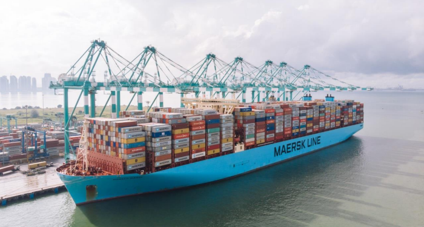
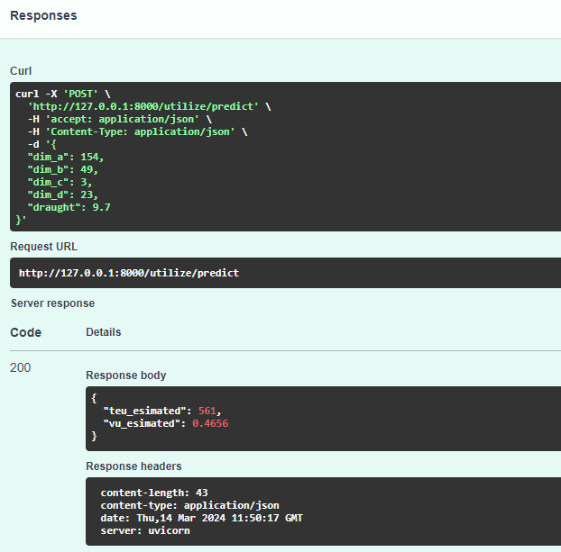
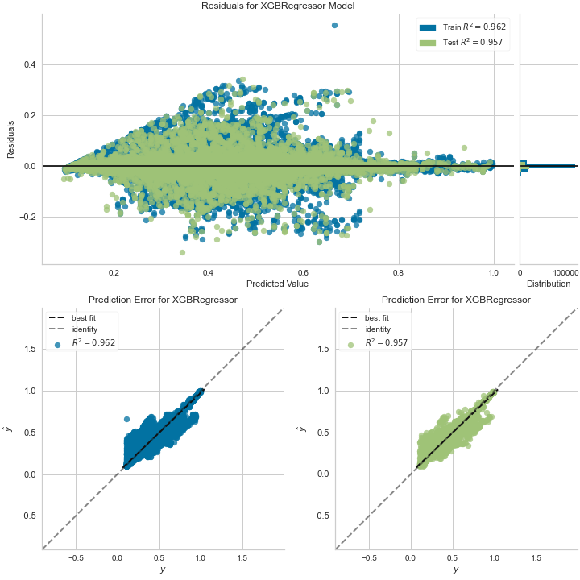

##  [Container Ships' Utilaization model.](https://www.cargotec.com/en/smarter-better-together/blogs-and-articles/the-problem-with-measuring-vessel-utilisation---and-how-to-improve-it/)

### Objective:
We want to use the AIS messages' data to predict the Vessel’s Utilization ( __VU__ ).\
Model should have personal API for input.
Model's output will be used as income feature for other models.

### Target:
We want to know: "Right now the container ship with the TEU designed capacity __**TEUdesigned**__
has on board the __**TEUestimated**__ containers actually".
Then we will be able to calculate Utilization ratio:
    __VU = TEUestimated / TEUdesigned__

### The Vessel’s Utilization model’s design & logic:
Finally to predict the __**Vessel Utilization**__ we plan to use info from AIS message#5.

    Data from AIS Message Type 5:
        Dimension to Bow
        Dimension to Stern
        Dimension to Port
        Dimension to Starboard
        Draught

To train a final model we will use a development dataset based on the enriched
data for container ships from the our latest shipDB and vessels tracker (voyages) dataset.

    Data from 'containershipdb_vu_devset.csv':
        ais_dim_a: equivalent for Dimension to Bow
        ais_dim_b: equivalent for Dimension to Stern
        ais_dim_c: equivalent for Dimension to Port
        ais_dim_d: equivalent for Dimension to Starboard
        draught  : Draught


#### The Challenge:
Since we does not have a ground truth data related to an amount of containers on ship’s board which we could to use as labeled target variables, we should create them.
To address this issue, we will use the simplified [Draught Survey](https://www.marineinsight.com/naval-architecture/draft-surveys-calculations-errors/) method to estimate a vessel's payload (actual useful load in tons, deadweight actual) with the m_cargo formula combination from [Estimation of ship operational efficiency using big data technology](https://www.sciencedirect.com/science/article/pii/S2092678220300091) paper.
Also we will use the Martyn Benson's [average cargo container estimation](https://www.quora.com/How-full-is-the-average-cargo-container-when-it-is-shipped-overseas).\
Later, we will use the __VUestimated__ as a data labeled for the final Vessel’s Utilization model training.

    PAYLOADestimated = (DRAFTactual / DRAFTdesigned) * DEADWEIGHTdesigned
                        - LIGHTWEIGHTdesigned
                        - FUELforVoyage
                        - LUB.OILforVoyage
                        - Ballast Water
                        - Fresh Water
                        - CONSTANTweight (provision, team, miscellaneous)

    TEUestimated = PAYLOADestimated / CONTAINERdensity

    VUestimated = TEUestimated / TEUdesigned

#### Data to perform "Draught Survey" method:
Variable  | Source: Name
------------- | -------------
DRAFTactual [dft_fact],AIS | Vessel_tracker:= draught
DRAFTdesigned [dft_design] | shipDB:= draught
DEADWEIGHTdesigned [dwt_design] | shipDB:= deadweight
LIGHTWEIGHTdesigned [lwt_design] | calc:= (displacement - dwt_design)
FUELforVoyage [voyage_fuel_tn] | calc:= (fc_tn_mile * voyage_ml) *1.05 (+5% reserve)
LUB.OILforVoyage [voyage_oil_tn] | calc:= voyage_fuel_tn * 6% (experts estimation)
BallastWater [ballast_water] | shipDB:= ballast_water
FreshWater [freshwater] | shipDB:= freshwater
CONSTANTweight [constant] | Assume:= Crew: 20 folks per 100kg per + Provision:10kg per person per day
CONTAINERdensity | 14 tons
======Auxilary data=======
Displacement [displacement] | shipDB:= displacement
Voyage distance, miles [voyage_ml] | s3://ls-aishub-inflated/voyages_vt_p1_wd/combined_vt:= distance
Voyage duration, hours [voyage_hr] | s3://ls-aishub-inflated/voyages_vt_p1_wd/combined_vt:= duration//3600
Fuel consumption per mile [fc_tn_mile] | MRV(merged):= Total FC [m tonnes] / dist_miles
Fuel consumption per hour [fc_tn_hr] | MRV(merged):= Total FC [m tonnes] / Annual Total time at sea [hours] * 24
Average speed, m/hour [speed_ml_hr] | MRV(merged):= dist_miles / Annual Total time at sea [hours]


#### Workflow's sequence:
    1. Prepare container ships data w/o missings:
        1.1 ./vutilize/data/shipdb_explore_data.py
        1.2 ./vutilize/data/shipdb_process_data.py
        1.3 ./vutilize/data//shipdb_train_model_enrich.py
    2. Prepare labeled development data set:
        2.1 ./vutilize/data//vu_create_dev_set.py
    3. Train 2 models with different targets 'vu_estimated' & 'teu_estimated':
        3.1 ./vutilize/model/train_model_ml.py

#### Model response example:


#### Models performance:
1. Vessel TEU estimation model:


2. Vessel Utilization model:


---
#### Project's folders structure:
_Some folders may be missing due project's particular aim._
```
[project's root folder]
├── data             <- Contains data sources for project.
│   ├── external     <- Auxilary data from third party sources.
│   ├── processed    <- The final data and dictionaries for modeling.
│   └── raw          <- The immutable input data.
├── docs             <- Keeps the project`s and models documentations.
├── mlflow           <- MLflow MLOps tools, mlregistry.db and trained models reside here.
│   ├── mlruns       <- Logged MLflow runs. Keeps models its params, metrics and artifacts.
│   ├── MLproject    <- MLproject file for packaging code in a reusable and reproducible way.
│   ├── README.md    <- Read me to maintain MLOps via MLflow.
│   └── conda.yaml   <- Required dependencies for MLproject through the YAML file.
├── models           <- MLflow MLOps tools, mlregistry.db and trained models reside here.
│   ├── mlmodels     <- Separatly saved models in MLflow Models format to be reused later.
│   ├── params       <- Separatly saved models` params.
│   └── predictions  <- The model`s output.
├── reports          <- Contains generated analysis as HTML, PDF, LaTeX, Excel and etc.
└── vutilize         <- Source code, scripts for use in this project.
    ├── _no_longer_useful <- Obviously, but might be helpful to look on previous ideas.
    ├── _assist      <- Any types of helping scripts.
    ├── api          <- REST API client for model.
    ├── aws          <- Notebooks and modules to run in clouds.
    ├── checks       <- Scripts to check some acts whether them works. Not unittests.
    ├── data         <- Scripts to get, to explore, to clean and to process data.
    └── model        <- Scripts to choose, fit & tune, train & evaluate model.
```
